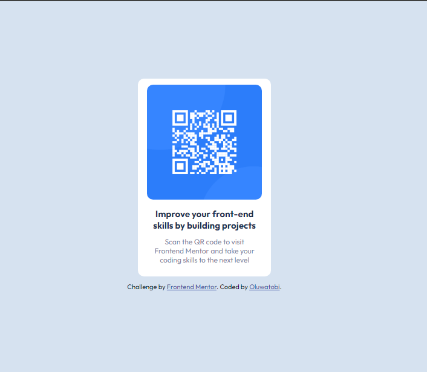

# Frontend Mentor - QR code component solution

This is a solution to the [QR code component challenge on Frontend Mentor](https://www.frontendmentor.io/challenges/qr-code-component-iux_sIO_H). Frontend Mentor challenges help you improve your coding skills by building realistic projects. 

## Table of contents

- [Overview](#overview)
  - [Screenshot](#screenshot)
  - [Links](#links)
- [My process](#my-process)
  - [Built with](#built-with)
  - [What I learned](#what-i-learned)
  - [Continued development](#continued-development)
- [Author](#author)  

## Overview

### Screenshot



### Links

- Solution URL: https://github.com/iBotayo/qr-code-component-main.git
- Live Site URL: [Add live site URL here](https://your-live-site-url.com)

## My process

### Built with

- Semantic HTML5 markup
- CSS custom properties
- Flexbox

### What I learned

While working on this project, I learnt how to structure and position contents in the centerusing flexbox. With this, I was able to increase my knowledge on flexbox

See below the code:

```css
body {
  font-family: "Outfit";
  background-color: hsl(212, 45%, 89%);
  display: flex;
  flex-flow: column;
  align-items: center;
  justify-content: center;
  height: 100vh;
  overflow: hidden;
  margin: 0;
  gap: 10px;
}
```
### Continued development

I would continue to expand my knowledge in flexbox, CSS Grid, and also learn to add javaScript for responsiveness.

## Author

- Frontend Mentor - [@iBotayo](https://www.frontendmentor.io/profile/iBotayo)
- Twitter - [@O_ibot](https://www.twitter.com/O_ibot)
